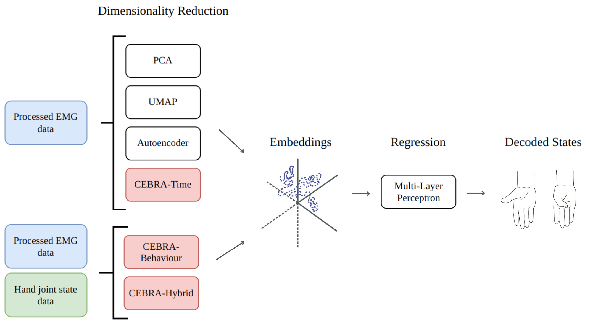
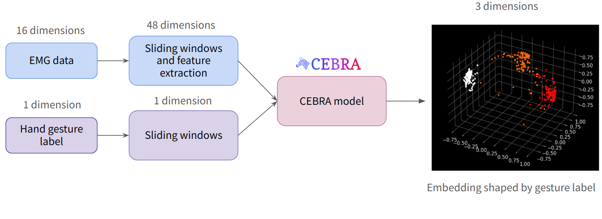
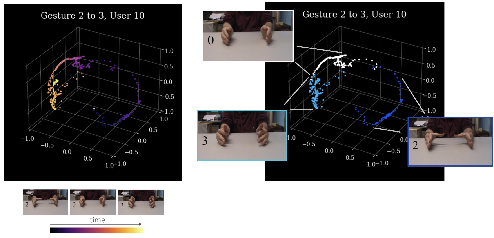
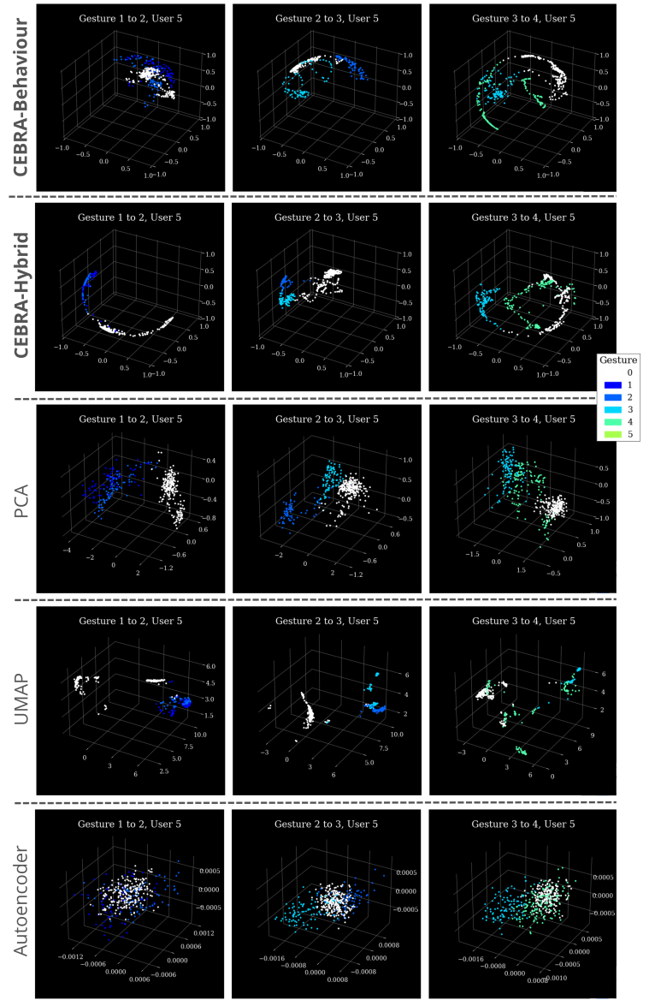

# Continuous Decoding of Hand Joint States using Electromyography Data

This repository contains the code I developed for my BEng dissertation at the University of Edinburgh. It investigates various dimensionality reduction methods for obtaining latent representations of EMG data, and training a neural network to perform regression using the embeddings for continuous decoding of the hand joint states.

The dimensionality reduction methods investigated are PCA, UMAP, Autoencoder, and [CEBRA](https://cebra.ai/). The regression model used is a Multi-Layer Perceptron. The main purpose of my dissertation was to explore the suitability of CEBRA for continuous decoding of hand joint states using EMG data.

    

## Data processing
The dataset used is the Ninapro DB8 dataset. It is not included in this repository due to size constraints. To run the code in this repository, please download the DB8 dataset from the [official website](https://ninapro.hevs.ch/instructions/DB8.html) and place all the files in a directory called `datasets`.

After downloading the dataset, run the script `data_processing.py` to process the raw data, perform feature extraction, and perform the linear mapping from the Cyberglove states to Degrees of Actuation of the IH2 Azzurra robotic hand.

## Classification
As a preliminary task, classification of hand gestures can be performed by running `classification_gridsearch.py`. 

    

## Regression
The main results of my dissertation are based on predicting hand joint states in a continuous manner by training regression models on various embeddings. These results can be replicated by running `regression_gridsearch.py`. 

    

    

